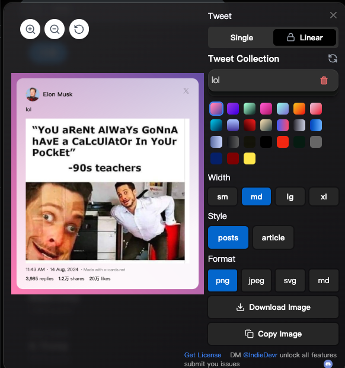
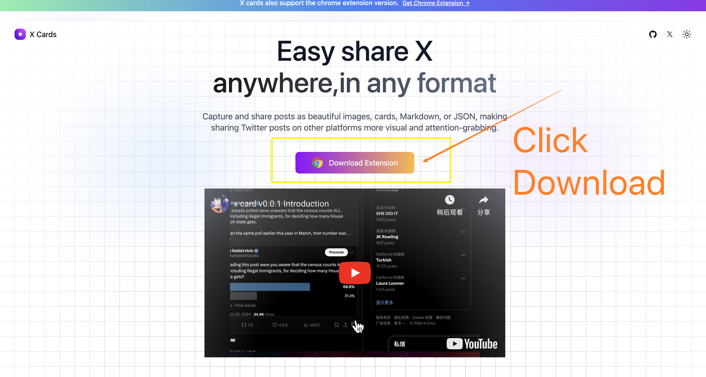
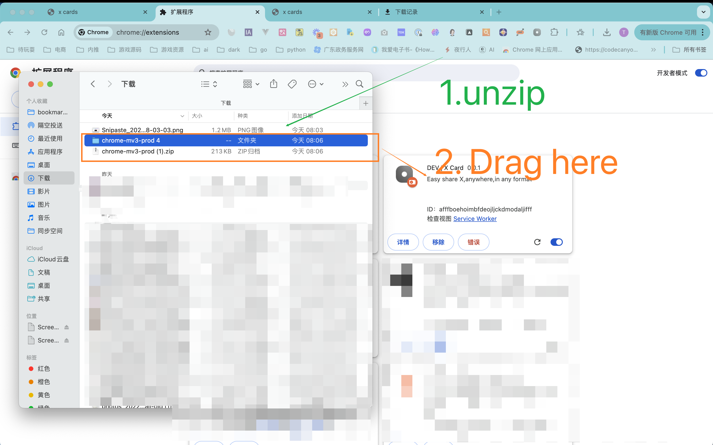

<a name="readme-top"></a>

<div align="center">

<h1>X Cards</h1>

[English](README.md) | [中文](README_ZH.md)

[](https://youtu.be/okCIZrFrTCE)

easy to use x-cards in x.com

[![][vercel-shield]][vercel-link]

[![][share-x-shield]][share-x-link]
[![][share-whatsapp-shield]][share-whatsapp-link]
[![][share-reddit-shield]][share-reddit-link]
[![][share-weibo-shield]][share-weibo-link]

[![][share-linkedin-shield]][share-linkedin-link]

[github-issues-link]: https://github.com/hzeyuan/x-cards/issues
[github-contributors-shield]: https://img.shields.io/github/contributors/hzeyuan/OpenGPTS?color=c4f042&labelColor=black&style=flat-square
[github-contributors-link]: https://github.com/hzeyuan/OpenGPTS/graphs/contributors
[vercel-link]: https://x-cards.net
[vercel-shield]: https://img.shields.io/website?down_message=offline&label=vercel&labelColor=black&logo=vercel&style=flat-square&up_message=online&url=https://x-cards.net
[share-linkedin-link]: https://linkedin.com/feed
[share-linkedin-shield]: https://img.shields.io/badge/-share%20on%20linkedin-black?labelColor=black&logo=linkedin&logoColor=white&style=flat-square
[share-reddit-link]: https://www.reddit.com/submit?title=x-cards&url=https://github.com/hzeyuan/x-cards
[share-reddit-shield]: https://img.shields.io/badge/-share%20on%20reddit-black?labelColor=black&logo=reddit&logoColor=white&style=flat-square
[share-telegram-link]: https://t.me/share/url?text=x-cards&url=https://github.com/hzeyuan/x-cards
[share-telegram-shield]: https://img.shields.io/badge/-share%20on%20telegram-black?labelColor=black&logo=telegram&logoColor=white&style=flat-square
[share-weibo-link]: http://service.weibo.com/share/share.php?sharesource=weibo&title=x-cards
[share-weibo-shield]: https://img.shields.io/badge/-share%20on%20weibo-black?labelColor=black&logo=sinaweibo&logoColor=white&style=flat-square
[share-whatsapp-link]: https://api.whatsapp.com/send?text=x-cards
[share-whatsapp-shield]: https://img.shields.io/badge/-share%20on%20whatsapp-black?labelColor=black&logo=whatsapp&logoColor=white&style=flat-square
[share-x-link]: https://x.com/intent/tweet?hashtags=chatbot%2CchatGPT%2CopenAI&url=https://github.com/hzeyuan/x-cards
[share-x-shield]: https://img.shields.io/badge/-share%20on%20x-black?labelColor=black&logo=x&logoColor=white&style=flat-square

</div>

⚡ **X Cards** Share Tweet anywhere ,any format,

## Project Background

X is a source of information for many platforms，So this project came into being


## Changelog

<details>
<summary><strong>v0.0.2</strong></summary>


* Added real-time preview feature, now a toast in the upper right corner allows you to observe the generated card.

* Introduced customization for card background color.

* Customizable card width.

* Improved: Now clicking defaults to copying the image, rather than downloading the image.

* Fixed the issue of unable to fetch cover image for videos.

* Added support for fetching continuous posts.

* Enabled dynamic addition, deletion, dragging, and management of posts.



</details>

<details>
<summary><strong>v0.0.1</strong></summary>

* Easy to access, just a simple click away.
* Obtain videos, images, text, likes。
* Export in multiple formats, including JSON, Markdown, PNG, JPEG, and SVG.

</details>

## features

* Added real-time preview feature, now a toast in the upper right corner allows you to observe the generated card.

* Introduced customization for card background color.

* Customizable card width.

* Improved: Now clicking defaults to copying the image, rather than downloading the image.

* Fixed the issue of unable to fetch cover image for videos.

* Added support for fetching continuous posts.

* Enabled dynamic addition, deletion, dragging, and management of posts.

<br/>

## How to Use


### [chrome web Store](https://chromewebstore.google.com/detail/x-card/mbinooofmcjhjklihfejnkkebffceeop)


##  or

1. Download Extension



2. url input:chrome://extensions/ in your chrome browser, and open the developer mode

3. unzip and Drag the extension file to the page



4. open x.com and browse the post, you will find your card button in the bottom right corner

## Development Guide

1. The project uses the Plasmo framework for rapid Chrome extension development.
2. Uses Next.js for frontend development.
3. Tailwind CSS and Shadcn as CSS frameworks.
4. Langchain for developing agents.
5. Deployed on Vercel.

Local development:

```bash
pnpm install

# Run frontend
npm run dev:next
# Run plugin
npm run dev:plasmo
```

## Starchart

[](https://star-history.com/#hzeyuan/x-cards&Date)
